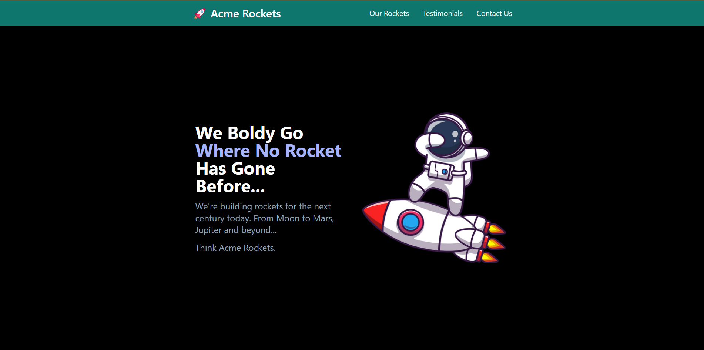
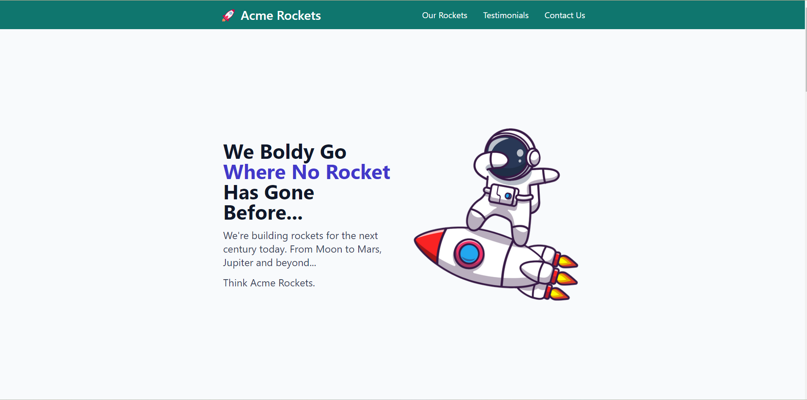
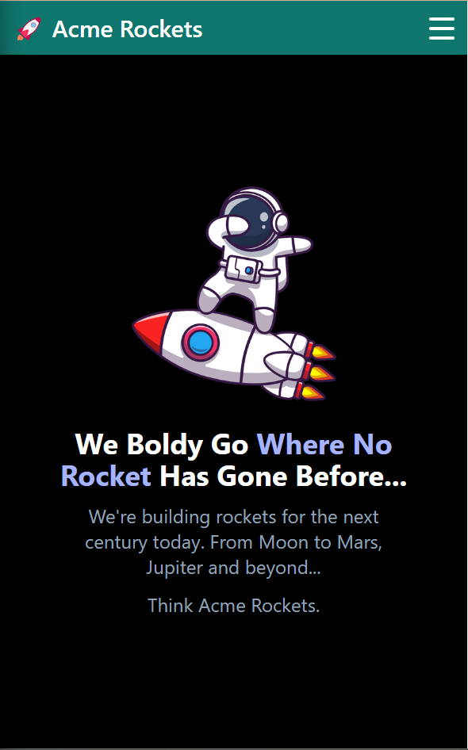
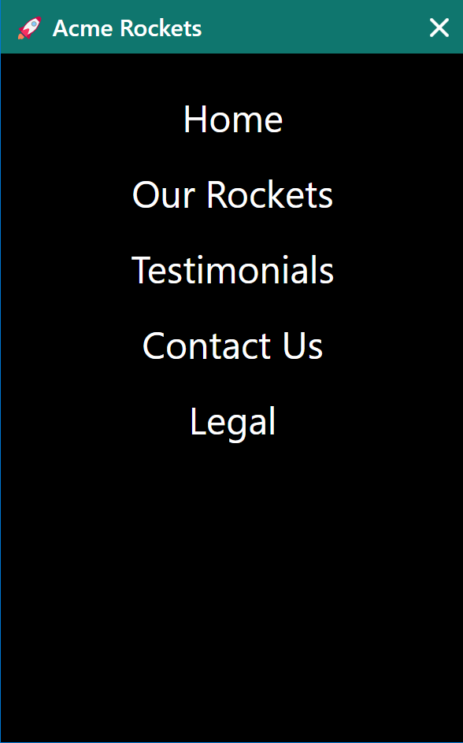

# Acme-Rockets-WebPage-Tutorial

This repository showcases a web project built with Tailwind CSS, a utility-first CSS framework.

## Project Description

The project in this repository demonstrates the use of Tailwind CSS in creating a responsive and visually appealing web application. Tailwind CSS is a highly customizable, low-level CSS framework that allows for easy styling and design.

## Features

- Responsive design
- Clean and maintainable code
- Utilizes Tailwind CSS utility classes

## Technologies Used

- HTML
- CSS (Tailwind CSS)

## Demo

Here some screenshots of how the webpage looks...

### Dark Mode



### Light Mode



### Mobile View



### Mobile Menu



## Getting Started

1. **Clone the Repository:**

    ```bash
    git clone https://github.com/belarminojunior/Acme-Rockets-WebPage-Tutorial
    ```

2. **Open `index.html` in a Browser:**

    Simply open the `index.html` file in your preferred web browser.

3. **Explore the Code:**

    Take a look at the HTML and CSS files to understand how Tailwind CSS classes are used to style the components.

## Customize and Extend

Feel free to customize and extend this project to meet your specific needs. Tailwind CSS makes it easy to tweak styles and create a unique design.

## Resources

- [Tailwind CSS Documentation](https://tailwindcss.com/docs)

## Contributing

If you'd like to contribute to this project, please follow the typical GitHub workflow:

1. Fork the repository.
2. Create a new branch for your feature or bug fix.
3. Make your changes and submit a pull request.

## License

This project is licensed under the [MIT License](LICENSE.md).

Happy coding!
